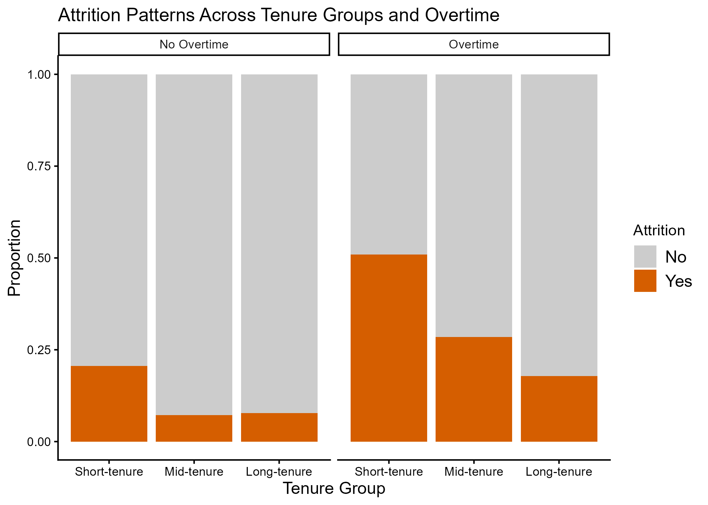
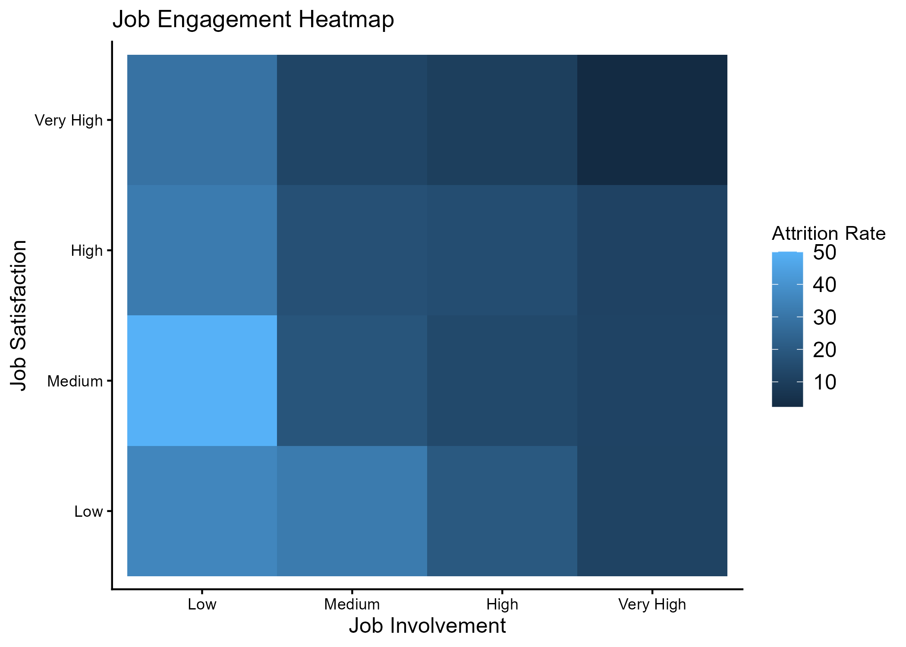

# IBM Employee Attrition Analysis

## Overview

This project utilizes data from the [IBM HR Analytics Employee Attrition Dataset](https://www.kaggle.com/datasets/pavansubhasht/ibm-hr-analytics-attrition-dataset).

**Attrition** is defined as the gradual workforce reduction through employee retirements, resignations, deaths, or elimination of positions without immediately filling vacancies (Society for Human Resource Management, 2024).

Objective:
Showcase skills in R such as data manipulation and visualization, as well as use exploratory data analysis and feature engineering to create insights from data. 

---

## Business Questions

- **What is attrition and why does it matter?**
- How do commutes affect job satisfaction?
-  Does overtime increase turnover?
- Which employee groups show the highest attrition?

---

## Methods

- Data Manipulation
- Exploratory Data Analysis
- Visualization
- Business Interpretation

Tools used: 
```plaintext
- R
- Tidyverse
- Packages: ggplot2 & janitor
- Quarto
```

---

## Key Findings

- Overtime is highly related to increased attrition rates
- New employees are most likely to leave
- Even more, new employees with overtime are the individuals at the highest risk for attrition
  
---

## Repository Structure

```plaintext
data/        
  raw/        # Original data
  processed/  # Cleaned dataset
output/
  figures/    # Generated visualizations
```

---

## View Full Analysis

→ Open [employee_attrition_analyses.qmd](employee_attrition_analyses.qmd)

---
## Key Visualizations





→ More located within `output/figures/`

---

## Future Work

- Statistical testing
- SQL integration
- Interactive dashboard
- Predictive modeling/ML
